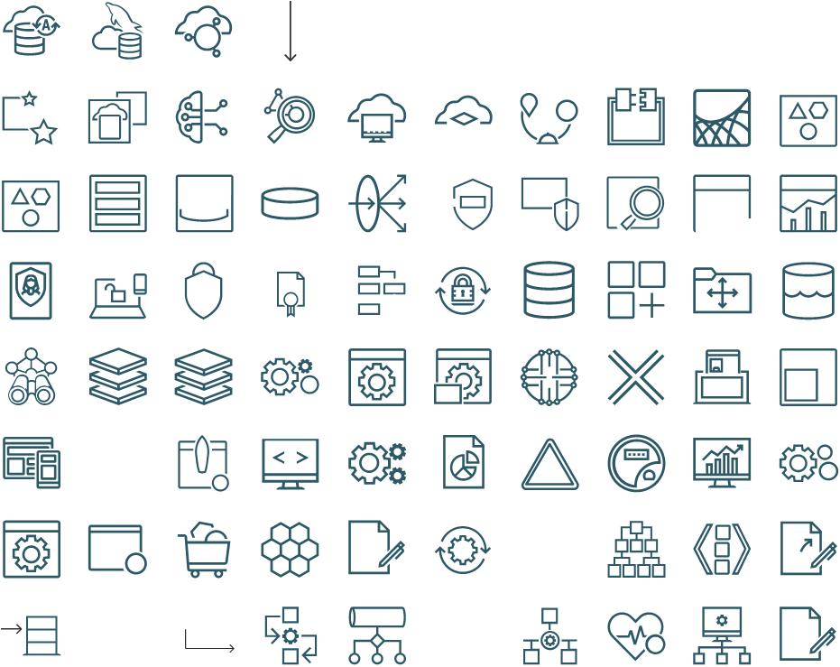

# DrawioToVisio

[](LICENSE)
[](#requirements)
[](#requirements)
[](#requirements)
[](docs/coverage.svg)
[](https://pypi.org/project/drawio-to-visio/)
[](https://pypi.org/project/drawio-to-visio/)

**Convert draw.io diagrams into fully editable, native Visio files — true
vector shapes, zero rasters — and extract every icon into a reusable Visio
stencil set (.vssx).**

Everything in the output is real Visio geometry: rounded rectangles, ovals,
polylines, smooth NURBS curves, dashed strokes, text, arrowheads. Every icon
line-art glyph keeps its hollow interiors (nonzero-winding holes are
faithfully reproduced), and you can select, recolour, and edit any element
afterwards in Visio.

---

## Why

Existing converters fall into two camps: EMF/image embeds (not editable) and
SVG importers that flatten line-art icons into solid dark blobs. This project
takes a third road — it parses the **draw.io XML itself**, decodes the
embedded stencil payloads, and redraws every shape through the Visio COM API
with a faithful reproduction of draw.io's nonzero-winding fill rule.

<p align="center">
  
</p>

*1,359 native Visio shapes converted from a 730 KB draw.io file — panels,
labels, connector arrows, and all 100+ line-art icons intact.*

## Features

- **Fully editable output** — every shape is a native Visio shape; recolour,
  move, restyle anything after conversion
- **Two-pass stencil pipeline** — first extract every icon into a named,
  de-duplicated `.vssx` stencil set, then build the final diagram by
  *dropping* those masters: each icon in the output is a single editable
  master instance instead of hundreds of loose polylines
- **True-vector icons** — embedded draw.io stencils are decoded
  (base64 + raw-deflate) and redrawn as real Visio geometry, never embedded
  as pictures
- **Real curve geometry** — closed loops made of cubic-bezier segments are
  emitted as NURBS curve rows, so circles and ellipses stay smooth at any
  zoom; straight segments stay straight lines
- **Nonzero-winding holes** — draw.io's hollow line-art (rings, gauge dials,
  document cut-outs) is reproduced exactly, including nested cut-outs that
  show glyphs *through* the hole; every hole boundary is stroked with the
  icon colour so thin slivers stay crisp at any size
- **Correct z-ordering** — containers, backdrops, and overlays are ordered by
  centre-containment depth, so titles never sink under their panels
- **Stencil extraction** — the `.vssx` masters can be dragged-dropped into
  any Visio document
- **Complete text preservation** — every label is rendered, including labels
  attached to icon-cluster cells (icon captions like multi-line names sit on
  stencil cells and are no longer dropped); font size / colour / bold /
  alignment parsed from the draw.io HTML labels; multi-line and RTL text
  supported
- **Generic** — works with plain `mxCell value=` files as well as
  `UserObject`-wrapped exports; handles containers, dashed strokes, ellipses,
  rounded rects, and arrow edges

## Requirements

- Windows with [Microsoft Visio](https://www.microsoft.com/microsoft-365/visio) 2016+
- Python 3.9+
- [pywin32](https://pypi.org/project/pywin32/)

```bash
pip install pywin32
```

> The converter drives the Visio desktop application via COM, so Windows +
> a Visio license are required. Linux/macOS are not supported.

## Quick start

Install from PyPI (Windows + Visio required for conversion):

```bash
pip install drawio-to-visio
```

Or directly from GitHub:

```bash
pip install git+https://github.com/soroshsabz/DrawioToVisio.git
```

Or from a clone:

```bash
git clone https://github.com/soroshsabz/DrawioToVisio.git
cd DrawioToVisio
pip install .
```

### Library usage

```python
from drawio_to_visio import convert, extract_stencils

# simple conversion (Visio required, Windows only)
convert("input.drawio", "output.vsdx")

# two-pass pipeline: extract icons, then convert using the stencil set
extract_stencils("input.drawio", "icons.vssx")
convert("input.drawio", "output.vsdx", stencil_vssx="icons.vssx")
```

Pure parsing helpers work on any OS (no Visio needed):

```python
from drawio_to_visio.core import load_cells, decode_stencil, parse_label

cells = load_cells("input.drawio")       # every mxCell / UserObject
prims, size = stencil_primitives(sel, fill, stroke)
```

### CLI usage

Two console scripts are installed with the package:

```bash
# Convert a diagram
drawio2visio input.drawio output.vsdx

# Extract every icon into a stencil set
drawio2stencils input.drawio icons.vssx

# Two-pass pipeline: stencils + master-instance diagram
drawio2visio input.drawio output.vsdx icons.vssx

# Preview a stencil set as an annotated contact sheet
python verify_sheet.py icons.vssx icons-sheet.png
```

The legacy scripts still work from a clone:

```bash
python drawio2visio.py input.drawio output.vsdx [icons.vssx]
python drawio2stencils.py input.drawio icons.vssx
```

Open the `.vsdx` in Visio — everything is editable. Open the `.vssx` from
Visio's *More Shapes* menu to drag-drop the extracted icons anywhere.

## Project layout

```
src/drawio_to_visio/     the installable package
├── core.py              conversion engine (parse → primitives → Visio COM)
├── stencils.py          icon clustering + stencil master generation
├── cli.py               argparse entry points
└── __init__.py          public API (convert, extract_stencils, ...)
tests/                   platform-independent unit tests
examples/                sample diagrams + converted outputs
```

The root-level `drawio2visio.py` / `drawio2stencils.py` files are thin CLI
wrappers around the package and remain runnable from a source checkout.

## Scripts

| Script | Purpose |
|---|---|
| `drawio2visio.py` | Convert a `.drawio` diagram to an editable `.vsdx`. Pass an optional `.vssx` path to switch on the stencil pipeline |
| `drawio2stencils.py` | Extract all icons into a `.vssx` stencil set |
| `verify_sheet.py` | Render a `.vssx` as a labeled contact-sheet PNG for review |

```text
python drawio2visio.py input.drawio output.vsdx [icons.vssx]
python drawio2stencils.py input.drawio icons.vssx
```

Both scripts accept absolute or relative paths.

## How it works

```
.drawio (mxGraph XML)
   │
   ├─ parse cells ──────── mxCell / UserObject, parent-relative geometry,
   │                        style key=value, HTML labels
   ├─ decode stencils ──── base64 + raw-deflate → URL-decoded stencil XML
   │                        (<move>/<line>/<curve>/<quad>/<arc>/<close>)
   ├─ build primitives ─── poly │ compound (multi-loop) │ rect │ oval
   │
   └─ paint via Visio COM
        ├─ stencil pipeline: dedupe icon clusters → named .vssx masters →
        │   page.Drop() master instances (one editable shape per icon)
        ├─ DrawPolyline / DrawBezier / DrawRectangle / DrawOval
        ├─ nonzero-winding fill: per-loop BAND winding sampled at the
        │   longest-edge midpoint nudged inward; winding = 0 → hole,
        │   painted as a background-coloured overlay with the icon colour
        │   stroked along every loop boundary (keeps thin slivers crisp)
        ├─ smooth curves: closed bezier chains → NURBSTo rows
        ├─ z-order: centre-containment depth (containers first)
        └─ text (all labels preserved), dashes, arrows, rounding,
            transparency
```

### The two hard problems

**1. Hollow icons.** Visio's `DrawPolyline` unions overlapping subpaths, and
`Selection.Subtract` refuses to punch holes between polyline shapes. The fix:
draw each loop as its own shape and emulate draw.io's nonzero-winding rule —
sample the winding number just inside each loop's band; `winding == 0` means
the loop interior is a hole. Hole overlays are stroked with the icon colour
so the anti-aliasing of the background fill never eats thin dark details.

**2. Text on icon cells.** draw.io commonly attaches captions (multi-line
icon names) to the same cells that carry the stencil artwork. When the
stencil pipeline replaces a cluster of cells with a single master instance,
those labels would vanish. The converter therefore re-renders every member
cell's label on top of the dropped master, at its original position and
formatting.

## Examples

The [`examples/`](examples/) folder contains:

- `sample-basic.drawio` — containers, dashed zones, ellipse, embedded
  stencil, arrow edge
- `sample-functional-view.drawio` — a real-world 730 KB functional-view
  diagram (758 vertex cells, 121 labels, 487 unique stencils)

Converted outputs (`.vsdx` / `.vssx`) are included so you can inspect the
results without running anything.

<p align="center">
  
</p>

*74 unique icon masters extracted from the sample into one stencil set.*

## Known limitations

- Edge routing uses source/target attachment points plus explicit waypoints;
  orthogonal obstacle-avoidance routing from draw.io is approximated
- Gradient fills, patterns, and shadows are out of scope (the flat design
  language of the sample diagrams converts 1:1)
- Fonts fall back to Visio defaults unless installed on the machine
- Very large files (>2,000 cells) take a few minutes — Visio COM calls
  dominate the runtime

## Testing

The test suite is split into two layers:

| Layer | Location | Needs Visio? | What it checks |
|---|---|---|---|
| Unit | `tests/unit/` | no | draw.io XML parsing, stencil decoding, primitive building, label parsing, public API |
| System (end-to-end) | `tests/system/` | yes | real `.drawio` → `.vsdx` / `.vssx` conversions, package validity, master instances, text preservation |

Run everything:

```bash
pip install -e .[dev]
python -m unittest discover -s tests -t . -v
```

With coverage:

```bash
coverage run -m unittest discover -s tests
coverage report -m
```

The system tests skip automatically when Microsoft Visio is not installed,
so the unit layer keeps CI green on plain runners. The live coverage badge
in the README is regenerated on every push to `main` by the CI pipeline
(unit layer scope).

## Packaging

The project is an installable Python package (`drawio-to-visio` on the src
layout) with console-script entry points:

```bash
pip install .            # library + drawio2visio / drawio2stencils commands
python -m build          # sdist + wheel
```

CI builds and validates the package on every PR, and publishes to PyPI
automatically when a `v*` tag is pushed (trusted publishing).

## Contributing

Issues and PRs are welcome. Useful areas: orthogonal edge routing, gradient
support, and a COM-free `.vsdx` writer (the OOXML format) to drop the Windows
requirement.

## License

[MIT](LICENSE) — free for commercial and personal use.
