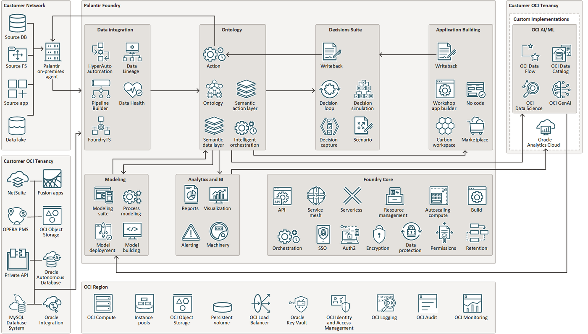

# DrawioToVisio

[](LICENSE)
[](#requirements)
[](#requirements)
[](#requirements)

**Convert draw.io diagrams into fully editable, native Visio files — true
vector shapes, zero rasters — and extract every icon into a reusable Visio
stencil set (.vssx).**

Everything in the output is real Visio geometry: rounded rectangles, ovals,
polylines, dashed strokes, text, arrowheads. Every icon line-art glyph keeps
its hollow interiors (nonzero-winding holes are faithfully reproduced), and
you can select, recolour, and edit any element afterwards in Visio.

---

## Why

Existing converters fall into two camps: EMF/image embeds (not editable) and
SVG importers that flatten line-art icons into solid dark blobs. This project
takes a third road — it parses the **draw.io XML itself**, decodes the
embedded stencil payloads, and redraws every shape through the Visio COM API
with a faithful reproduction of draw.io's nonzero-winding fill rule.

<p align="center">
  
</p>

*1,359 native Visio shapes converted from a 730 KB draw.io file — panels,
labels, connector arrows, and all 100+ line-art icons intact.*

## Features

- **Fully editable output** — every shape is a native Visio shape; recolour,
  move, restyle anything after conversion
- **True-vector icons** — embedded draw.io stencils are decoded
  (base64 + raw-deflate) and redrawn as polylines, never embedded as pictures
- **Nonzero-winding holes** — draw.io's hollow line-art (rings, gauge dials,
  document cut-outs) is reproduced exactly, including nested cut-outs that
  show glyphs *through* the hole (pie chart on a document, molecule over
  binoculars)
- **Correct z-ordering** — containers, backdrops, and overlays are ordered by
  centre-containment depth, so titles never sink under their panels
- **Stencil extraction** — group every icon into named, de-duplicated
  `.vssx` masters you can drag-drop in any Visio document
- **Text fidelity** — font size / colour / bold / alignment parsed from the
  draw.io HTML labels; multi-line and RTL text supported
- **Generic** — works with plain `mxCell value=` files as well as
  `UserObject`-wrapped exports; handles containers, dashed strokes, ellipses,
  rounded rects, and arrow edges

## Requirements

- Windows with [Microsoft Visio](https://www.microsoft.com/microsoft-365/visio) 2016+
- Python 3.9+
- [pywin32](https://pypi.org/project/pywin32/)

```bash
pip install pywin32
```

> The converter drives the Visio desktop application via COM, so Windows +
> a Visio license are required. Linux/macOS are not supported.

## Quick start

```bash
git clone https://github.com/soroshsabz/DrawioToVisio.git
cd DrawioToVisio
pip install pywin32

# Convert a diagram
python drawio2visio.py examples/sample-basic.drawio output.vsdx

# Extract every icon into a stencil set
python drawio2stencils.py examples/sample-basic.drawio icons.vssx

# Preview a stencil set as an annotated contact sheet
python verify_sheet.py icons.vssx icons-sheet.png
```

Open the `.vsdx` in Visio — everything is editable. Open the `.vssx` from
Visio's *More Shapes* menu to drag-drop the extracted icons anywhere.

## Scripts

| Script | Purpose |
|---|---|
| `drawio2visio.py` | Convert a `.drawio` diagram to an editable `.vsdx` |
| `drawio2stencils.py` | Extract all icons into a `.vssx` stencil set |
| `verify_sheet.py` | Render a `.vssx` as a labeled contact-sheet PNG for review |

```text
python drawio2visio.py input.drawio output.vsdx
python drawio2stencils.py input.drawio icons.vssx
```

Both scripts accept absolute or relative paths. `drawio2stencils.py` imports
the parsing/painting engine from `drawio2visio.py`, so keep the two files in
the same folder.

## How it works

```
.drawio (mxGraph XML)
   │
   ├─ parse cells ──────── mxCell / UserObject, parent-relative geometry,
   │                        style key=value, HTML labels
   ├─ decode stencils ──── base64 + raw-deflate → URL-decoded stencil XML
   │                        (<move>/<line>/<curve>/<quad>/<arc>/<close>)
   ├─ build primitives ─── poly │ compound (multi-loop) │ rect │ oval
   │
   └─ paint via Visio COM
        ├─ DrawPolyline / DrawRectangle / DrawOval
        ├─ nonzero-winding fill: per-loop BAND winding sampled at the
        │   longest-edge midpoint nudged inward; winding = 0 → background
        │   fill (hole), else icon colour — painted outer-first
        ├─ z-order: centre-containment depth (containers first)
        └─ text, dashes, arrows, rounding, transparency
```

### The two hard problems

**1. Hollow icons.** Visio's `DrawPolyline` unions overlapping subpaths, and
`Selection.Subtract` refuses to punch holes between polyline shapes. The fix:
draw each loop as its own shape and emulate draw.io's nonzero-winding rule —
sample the winding number just inside each loop's band; `winding == 0` means
the loop interior is a hole and gets painted with the backdrop colour.

**2. Nested cut-outs.** A document icon with a pie chart *inside* it needs the
glyph drawn **after** the white hole that cuts it. Draw order is therefore a
containment sort: any cell whose bounding box contains another cell's centre
is a container and paints first.

Both rules and several more gotchas are documented in detail in the source.

## Examples

The [`examples/`](examples/) folder contains:

- `sample-basic.drawio` — containers, dashed zones, ellipse, embedded
  stencil, arrow edge
- `sample-palantir-aip.drawio` — a real-world 730 KB Palantir Foundry AIP
  functional-view diagram (758 vertex cells, 121 labels, 487 unique
  stencils)

Converted outputs (`.vsdx` / `.vssx`) are included so you can inspect the
results without running anything.

<p align="center">
  
</p>

*74 unique icon masters extracted from the Palantir sample into one stencil set.*

## Known limitations

- Edge routing uses source/target attachment points plus explicit waypoints;
  orthogonal obstacle-avoidance routing from draw.io is approximated
- Gradient fills, patterns, and shadows are out of scope (the Palantir-style
  flat design language converts 1:1)
- Fonts fall back to Visio defaults unless installed on the machine
- Very large files (>2,000 cells) take a few minutes — Visio COM calls
  dominate the runtime

## Contributing

Issues and PRs are welcome. Useful areas: orthogonal edge routing, gradient
support, and a COM-free `.vsdx` writer (the OOXML format) to drop the Windows
requirement.

## License

[MIT](LICENSE) — free for commercial and personal use.
